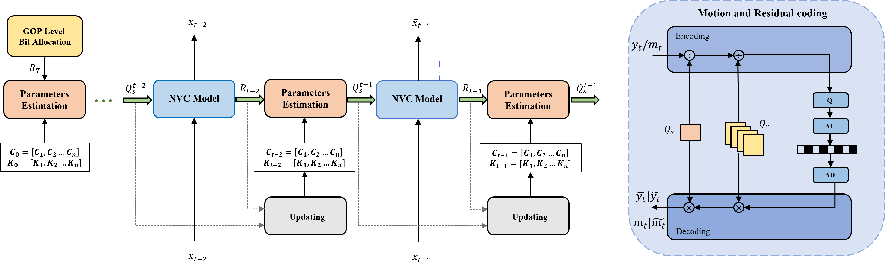

# Rate-control-for-NVC
# Introduction

Pytorch implementation of the paper "RATE-QUALITY BASED RATE CONTROL MODEL FOR NEURAL VIDEO COMPRESSION". ICASSP 2024.

## Requirements

- Python==3.7
- PyTorch==1.11

## About

This repository defines a rate control approach for learned video compression, which is designed to minimize bitrate errors while effectively preserving the hierarchical inter-frame quality structure. After obtaining the target bit rate, first perform multi granularity bit rate allocation on the target bit rate, including gop level and frame level. After obtaining the target bitrate of the current frame, the coding parameters are calculated through R-Q modeling for actual coding. Finally, the R-Q model is updated in real-time based on the rate error, and enters the coding process of the next frame.


## Data Preparation
### Test Dataset
The test datasets include:
-  HEVC common test sequences
Basically, the test sequences are cropped. After that, both the width and height are the multiplier of 64. Subsequently, we split them into consecutive pictures by ffmpeg. Taking HEVC ClassB as example, the data process is shown as follows. 
1. Crop Videos from 1920x1080 to 1920x1024.
    ```
    ffmpeg -pix_fmt yuv420p  -s 1920x1080 -i ./videos/xxxx.yuv -vf crop=1920:1024:0:0 ./videos_crop/xxxx.yuv
    ```
2. Convert YUV files to images.
    ```
    ffmpg -s 1920x1024 -pix_fmt yuv420p -i ./videos_crop/xxxx.yuv ./images_crop/xxxx/im%3d.png
    ```
3. The file structure of the test dataset:
- HEVC
  - ClassB or C, and D
    - images_crop
      - im1.png
      - ...... 
## Evaluation
Different target bitrates should be selected for different sequences, because the encoding bandwidth of NVC is not wide enough to achieve unlimited bitrate control. Here we provide the target bit rate(bpp) as a reference.
- Class B 
  - BasketballDrive : 0.05
  - BQTerrace: 0.10
  - Cactus: 0.05 
  - Kimono: 0.05
  - ParkScene: 0.05
- Class C
  - BasketballDrill: 0.10
  - BQMall: 0.10      
  - Party: 0.20             
  - RaceHorsesC: 0.20
- Class D
  - RaceHorses: 0.20        
  - BQSquare: 0.15   
  - BlowingBubbles: 0.15    
  - BasketballPass: 0.10
When testing, you can specify the test sequence through '--test_class' and '--sec_id', and specify the target bitrate through '--target_bpp'. Take the 'RaceHorses' sequence of ClassD as an example: 
```
python control_eval.py --test_class ClassD --sec_id 0 --target_bpp 0.20
```
## Citation
If you find this paper useful, please cite:
```
@inproceedings{liao2024rate,
  title={Rate-Quality Based Rate Control Model for Neural Video Compression},
  author={Liao, Shuhong and Jia, Chuanmin and Fan, Hongfei and Yan, Jingwen and Ma, Siwei},
  booktitle={ICASSP 2024-2024 IEEE International Conference on Acoustics, Speech and Signal Processing (ICASSP)},
  pages={4215--4219},
  year={2024},
  organization={IEEE}
}
```


